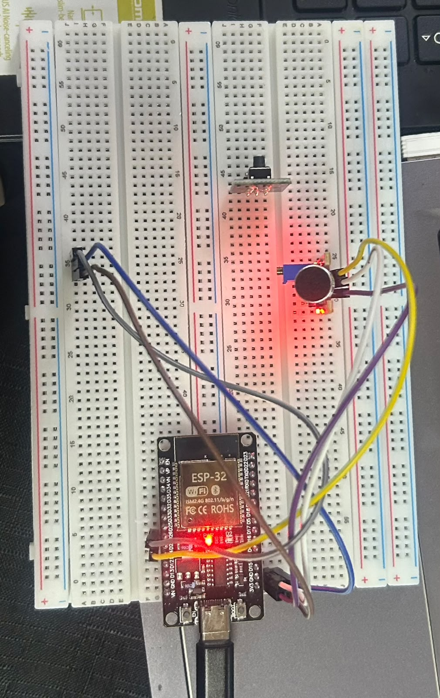
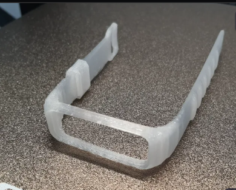

# TechDevelopers
  TechDevelopers - SafeGrid | Domain 5: Smart City Safety for Mining Towns

Problem:GBV & public safety crisis in mining hostels - no lighting, no quick response, no offline system.

Our Solution: Wearable panic button + Sound detection (KY-038) -> ESP-32 Gateway on MB-102 breadboard (your prototype) -> Actuation: KY-008 Laser floodlight ON + Relay/Turnstile lock + 3D Risk Map flashing.

1. How It Works
1. Sender: Victim presses panic button OR screams -> KY-038 detects
2. Gateway: ESP-32 on breadboard (see photo) processes locally - no internet needed
3. Actuation: Laser ON (high-intensity light) + DC-PUMP/Relay ON (safe zone turnstile)
4. Map: Publishes MQTT JSON {"gatewayId":"POLE_A3_Mbombela","type":"GBV_PANIC"} -> 3D dashboard RED

 2. Hardware Used
- Gateway: ESP-32 DevKit + MB-102 long breadboard (as in prototype) + BMT protoboard for final
- Sensors: KY-038 Sound, HC-SR04 Ultrasonic, Push Button (panic)
- Actuators: KY-008 Laser, 1-Channel Relay + DC-PUMP
- Enclosure: 3D printed pole holder (120x85x35mm) + SOS bracelet (50x35x15mm)

3. Wiring (Final)
- Button -> GPIO2
- KY-038 DO -> GPIO4
- HC-SR04 TRIG->GPIO6 ECHO->GPIO7
- KY-008 Laser S -> GPIO8
- Relay IN -> GPIO9
- All VCC->3V3 rail, GND->GND rail

4. Code
See folder /emergency-safety-platform - contains:
- Pole_Gateway.ino - edge logic
- SOS_Bracelet.ino - wearable sender

5. Demo Video & Team
Team: TechDevelopers - Mbombela, Mpumalanga
Repo has: Prototypes.jpeg, Team photo, hackers project.pptx
To run: Upload Pole_Gateway.ino to ESP-32, press button, laser fires, Serial shows JSON.

Built for offline-first mining towns
